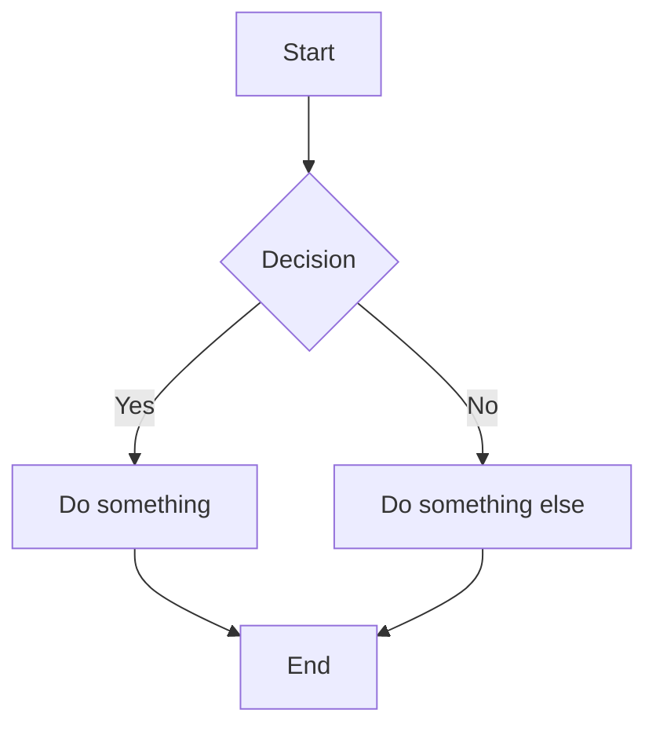

# docsify-mermaid-zoom

Interactive mermaid diagrams for [docsify](https://docsify.js.org/) — zoom, pan, resize, and fullscreen.


## Features

- **Pinch-to-zoom / Ctrl+scroll** on any mermaid diagram (regular scrolling passes through to the page)
- **Click-and-drag to pan** with grab/grabbing cursor
- **Resize handle** — drag the bottom-right corner to make the diagram taller/shorter
- **Fullscreen mode** — expand any diagram to fill the viewport (ESC to exit)
- **Zoom controls** — +, -, reset buttons in the top-right corner
- **Auto-fit** — diagrams fit and center on load, resize, and page navigation
- **Configurable** — min/max zoom, container height limits, render delay
- **Graceful fallback** — if svg-pan-zoom fails, diagrams still render normally

## Install

### CDN (recommended for docsify)

Add to your docsify `index.html`, after mermaid and docsify-mermaid:

```html
<!-- CSS -->
<link rel="stylesheet" href="https://cdn.jsdelivr.net/npm/docsify-mermaid-zoom/dist/docsify-mermaid-zoom.css">

<!-- Dependencies (load these first) -->
<script src="https://cdn.jsdelivr.net/npm/mermaid/dist/mermaid.min.js"></script>
<script src="https://cdn.jsdelivr.net/npm/docsify-mermaid@2/dist/docsify-mermaid.js"></script>
<script src="https://cdn.jsdelivr.net/npm/svg-pan-zoom@3.6.1/dist/svg-pan-zoom.min.js"></script>

<!-- Plugin -->
<script src="https://cdn.jsdelivr.net/npm/docsify-mermaid-zoom/dist/docsify-mermaid-zoom.js"></script>
```

### npm

```bash
npm install docsify-mermaid-zoom
```

Then reference `node_modules/docsify-mermaid-zoom/dist/` in your HTML.

## Dependencies

These must be loaded **before** docsify-mermaid-zoom:

| Package | Purpose |
|---------|---------|
| [mermaid](https://mermaid.js.org/) | Renders mermaid markdown into SVG |
| [docsify-mermaid](https://github.com/Leward/mermaid-docsify) | Hooks mermaid into docsify's rendering pipeline |
| [svg-pan-zoom](https://github.com/bumbu/svg-pan-zoom) | Provides zoom/pan/fit on SVG elements |

## Configuration

Optional — configure via `window.$docsify.mermaidZoom`:

```html
<script>
  window.$docsify = {
    // ... your docsify config
    mermaidZoom: {
      renderDelay: 300,   // ms to wait for mermaid to finish rendering
      minZoom: 0.1,       // minimum zoom level
      maxZoom: 10,        // maximum zoom level
      minHeight: 300,     // minimum container height (px)
      maxHeight: 800      // maximum container height (px)
    }
  }
</script>
```

## Theming

The accent color used for hover borders and button highlights can be customized with a CSS variable:

```css
:root {
  --mermaid-zoom-accent: #0F766E;
}
```

## How it works

1. After each docsify page render, the plugin waits for mermaid to finish rendering SVGs
2. Each `.mermaid` element gets wrapped in a `.mermaid-zoom-container` div
3. The container is sized proportionally to the diagram's aspect ratio
4. `svg-pan-zoom` is initialized on the SVG with fit + center
5. Zoom controls, fullscreen button, and resize handle are added
6. A `ResizeObserver` watches the container so dragging the resize handle re-fits the diagram

## Full example

```html
<!DOCTYPE html>
<html>
<head>
  <link rel="stylesheet" href="https://cdn.jsdelivr.net/npm/docsify-themeable@0/dist/css/theme-simple.css">
  <link rel="stylesheet" href="https://cdn.jsdelivr.net/npm/docsify-mermaid-zoom/dist/docsify-mermaid-zoom.css">
</head>
<body>
  <div id="app"></div>
  <script>
    window.$docsify = {
      loadSidebar: true,
      mermaidZoom: { maxHeight: 600 }
    }
  </script>
  <script src="https://cdn.jsdelivr.net/npm/docsify@4/lib/docsify.min.js"></script>
  <script src="https://cdn.jsdelivr.net/npm/mermaid/dist/mermaid.min.js"></script>
  <script src="https://cdn.jsdelivr.net/npm/docsify-mermaid@2/dist/docsify-mermaid.js"></script>
  <script>mermaid.initialize({ startOnLoad: false });</script>
  <script src="https://cdn.jsdelivr.net/npm/svg-pan-zoom@3.6.1/dist/svg-pan-zoom.min.js"></script>
  <script src="https://cdn.jsdelivr.net/npm/docsify-mermaid-zoom/dist/docsify-mermaid-zoom.js"></script>
</body>
</html>
```

Then in any markdown file:

````markdown

````

## License

MIT
