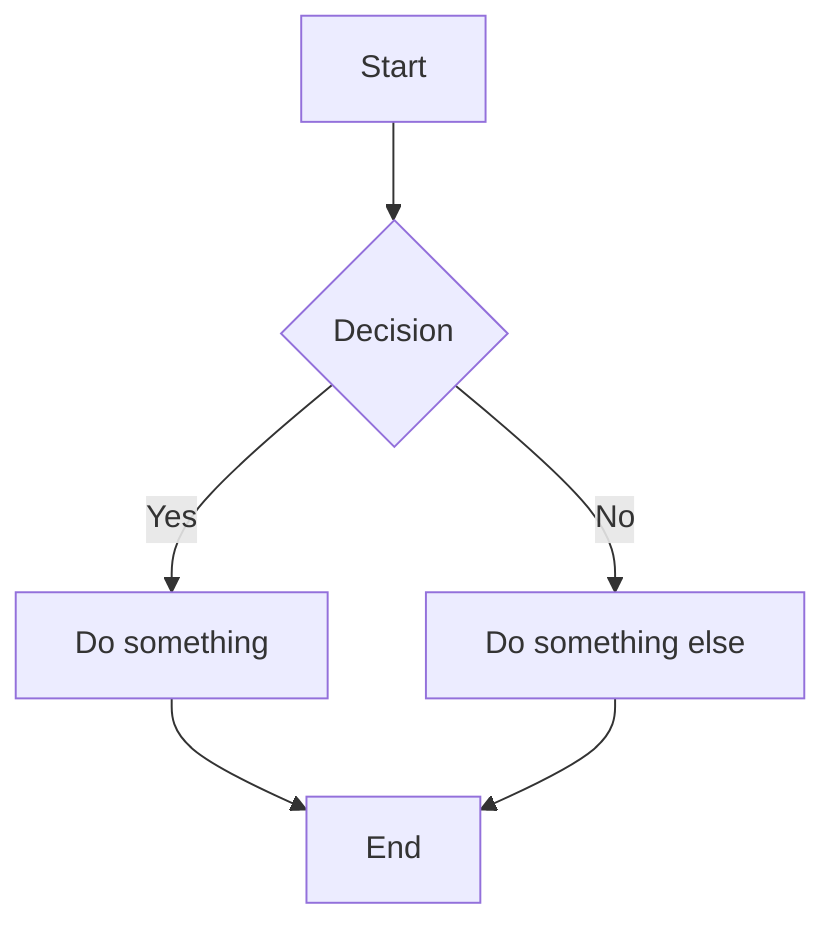

# docsify-mermaid-zoom

Interactive mermaid diagrams for [docsify](https://docsify.js.org/) — zoom, pan, resize, and fullscreen.


## Features

- **Click-to-focus interaction** — click a diagram to focus it. When focused: two-finger scroll pans the diagram, arrow keys navigate. ESC releases focus. Unfocused diagrams let scroll pass through to the page.
- **Pinch-to-zoom / Ctrl+scroll** — always works regardless of focus state
- **Click-and-drag to pan** with grab/grabbing cursor
- **Resize handle** — drag the bottom-right corner to make the diagram taller/shorter
- **Fullscreen mode** — expand any diagram to fill the viewport (auto-focused, ESC to exit)
- **Zoom controls** — +, -, reset buttons in the top-right corner
- **Auto-fit** — diagrams fit and center on load, resize, and page navigation
- **Visual focus indicator** — teal outline ring shows when a diagram is active
- **Auto-loads dependencies** — mermaid and svg-pan-zoom are loaded from CDN automatically if not already present
- **Configurable** — min/max zoom, container height limits, render delay, debug mode, mermaid config pass-through
- **Graceful fallback** — if svg-pan-zoom fails, diagrams still render normally

## Install

### CDN (recommended for docsify)

Just two lines in your docsify `index.html` — that's it:

```html
<link rel="stylesheet" href="https://cdn.jsdelivr.net/npm/@chadfurman/docsify-mermaid-zoom@2/dist/docsify-mermaid-zoom.css">
<script src="https://cdn.jsdelivr.net/npm/@chadfurman/docsify-mermaid-zoom@2/dist/docsify-mermaid-zoom.js"></script>
```

The plugin auto-loads mermaid and svg-pan-zoom from CDN if they aren't already on the page.

### npm

```bash
npm install @chadfurman/docsify-mermaid-zoom
```

Then reference `node_modules/@chadfurman/docsify-mermaid-zoom/dist/` in your HTML.

### Manual setup (advanced)

If you want to control exact dependency versions, load them yourself before the plugin. The plugin will detect they're already present and skip auto-loading:

```html
<!-- Dependencies (loaded manually) -->
<script src="https://cdn.jsdelivr.net/npm/mermaid@11/dist/mermaid.min.js"></script>
<script src="https://cdn.jsdelivr.net/npm/svg-pan-zoom@3.6.1/dist/svg-pan-zoom.min.js"></script>

<!-- Plugin (detects deps are already loaded, skips auto-load) -->
<link rel="stylesheet" href="https://cdn.jsdelivr.net/npm/@chadfurman/docsify-mermaid-zoom@2/dist/docsify-mermaid-zoom.css">
<script src="https://cdn.jsdelivr.net/npm/@chadfurman/docsify-mermaid-zoom@2/dist/docsify-mermaid-zoom.js"></script>
```

> **Note:** As of v2.0, `docsify-mermaid` is no longer needed as a separate dependency — its functionality is inlined into this plugin.

## Configuration

Optional — configure via `window.$docsify.mermaidZoom`:

```html
<script>
  window.$docsify = {
    // ... your docsify config
    mermaidZoom: {
      renderDelay: 300,   // ms to wait for mermaid to finish rendering
      minZoom: 0.1,       // minimum zoom level
      maxZoom: 10,        // maximum zoom level
      minHeight: 300,     // minimum container height (px)
      maxHeight: 800,     // maximum container height (px)
      debug: false,       // enable [mermaid-zoom] console logs
      mermaidConfig: {    // passed directly to mermaid.initialize()
        theme: 'neutral',
        flowchart: { curve: 'linear' }
      }
    }
  }
</script>
```

### Mermaid config pass-through

The `mermaidConfig` option is passed directly to `mermaid.initialize()` along with `{ startOnLoad: false, theme: 'default' }` as defaults. Any keys you provide will override the defaults. This is useful for setting mermaid themes, flowchart options, sequence diagram config, etc.

## Theming

The accent color used for hover borders and button highlights can be customized with a CSS variable:

```css
:root {
  --mermaid-zoom-accent: #0F766E;
}
```

## How it works

1. The plugin registers a docsify `afterEach` hook that converts mermaid code blocks into `<div class="mermaid">` elements
2. In the `doneEach` hook, it auto-loads mermaid and svg-pan-zoom from CDN (if not already present)
3. Mermaid is initialized once, then `mermaid.run()` processes unrendered diagrams
4. Each `.mermaid` element gets wrapped in a `.mermaid-zoom-container` div
5. The container is sized proportionally to the diagram's aspect ratio
6. `svg-pan-zoom` is initialized on the SVG with fit + center
7. Zoom controls, fullscreen button, and resize handle are added
8. A `ResizeObserver` watches the container so dragging the resize handle re-fits the diagram

## Full example

```html
<!DOCTYPE html>
<html>
<head>
  <link rel="stylesheet" href="https://cdn.jsdelivr.net/npm/docsify-themeable@0/dist/css/theme-simple.css">
  <link rel="stylesheet" href="https://cdn.jsdelivr.net/npm/@chadfurman/docsify-mermaid-zoom@2/dist/docsify-mermaid-zoom.css">
</head>
<body>
  <div id="app"></div>
  <script>
    window.$docsify = {
      loadSidebar: true,
      mermaidZoom: {
        maxHeight: 600,
        mermaidConfig: { theme: 'default' }
      }
    }
  </script>
  <script src="https://cdn.jsdelivr.net/npm/docsify@4/lib/docsify.min.js"></script>
  <script src="https://cdn.jsdelivr.net/npm/@chadfurman/docsify-mermaid-zoom@2/dist/docsify-mermaid-zoom.js"></script>
</body>
</html>
```

Then in any markdown file:

````markdown

````

## Migrating from v1.x

v2.0 is a breaking change that simplifies setup. Remove the old dependency lines:

```diff
  <link rel="stylesheet" href="...docsify-mermaid-zoom.css">
- <script src="https://cdn.jsdelivr.net/npm/mermaid/dist/mermaid.min.js"></script>
- <script src="https://cdn.jsdelivr.net/npm/docsify-mermaid@2/dist/docsify-mermaid.js"></script>
- <script>mermaid.initialize({ startOnLoad: false });</script>
- <script src="https://cdn.jsdelivr.net/npm/svg-pan-zoom@3.6.1/dist/svg-pan-zoom.min.js"></script>
  <script src="...docsify-mermaid-zoom.js"></script>
```

If you were passing options to `mermaid.initialize()`, move them to `mermaidConfig`:

```javascript
mermaidZoom: {
  mermaidConfig: { theme: 'neutral' }
}
```

## License

MIT
