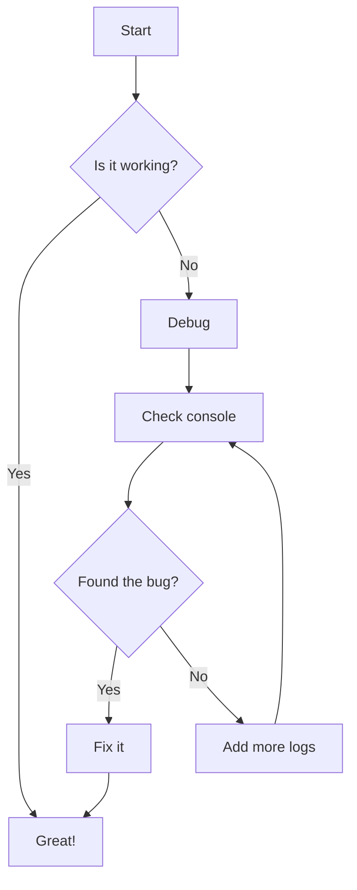
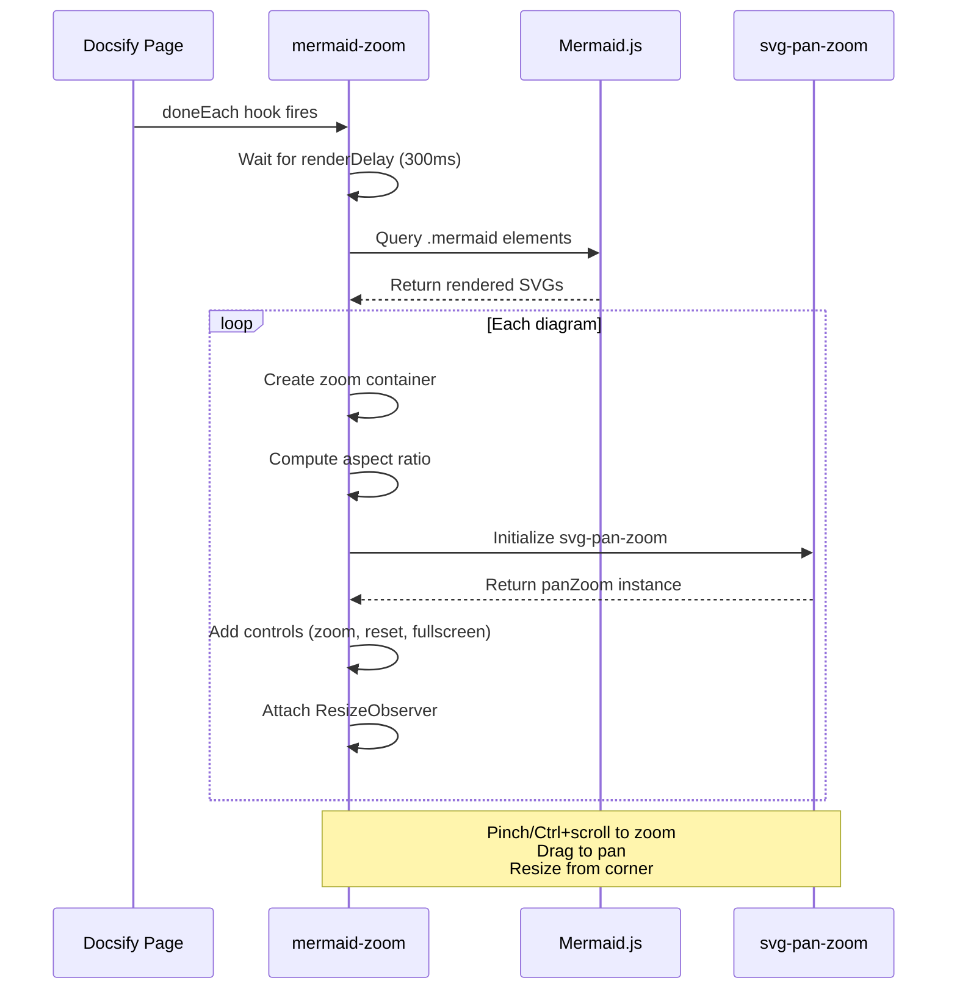
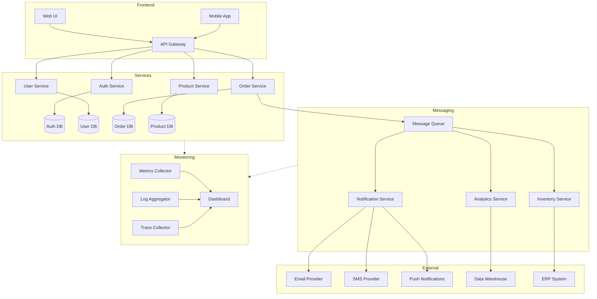

# docsify-mermaid-zoom Demo

Interactive mermaid diagrams for [docsify](https://docsify.js.org/) with zoom, pan, resize, and fullscreen.

## Simple Flowchart

A basic decision flow. Try **pinch-to-zoom** (trackpad) or **Ctrl+scroll** (mouse) to zoom in and out. Click and drag to pan around.



## Sequence Diagram

A medium-complexity sequence diagram showing how the plugin initializes. Drag the **bottom-right corner** of the container to resize it vertically.



## Complex Graph with Subgraphs

A larger diagram that benefits from zoom. Click the **fullscreen button** (top-right corner) to expand the diagram to fill your screen. Press **ESC** to exit.



## Features

| Feature | How to use |
|---------|-----------|
| **Zoom** | Pinch (trackpad) or Ctrl+scroll (mouse wheel) |
| **Pan** | Click and drag inside the diagram |
| **Resize** | Drag the bottom-right corner of the container |
| **Fullscreen** | Click the expand button in the top-right controls |
| **Reset** | Click the reset button to fit and center |
| **Zoom buttons** | Use + and - buttons for precise zoom |

## Installation

Just two lines — the plugin auto-loads mermaid and svg-pan-zoom:

```html
<link rel="stylesheet" href="https://cdn.jsdelivr.net/npm/@chadfurman/docsify-mermaid-zoom@2/dist/docsify-mermaid-zoom.css">
<script src="https://cdn.jsdelivr.net/npm/@chadfurman/docsify-mermaid-zoom@2/dist/docsify-mermaid-zoom.js"></script>
```

Or install via npm:

```bash
npm install @chadfurman/docsify-mermaid-zoom
```

See the full [README](https://github.com/chadfurman/docsify-mermaid-zoom) for configuration options.
